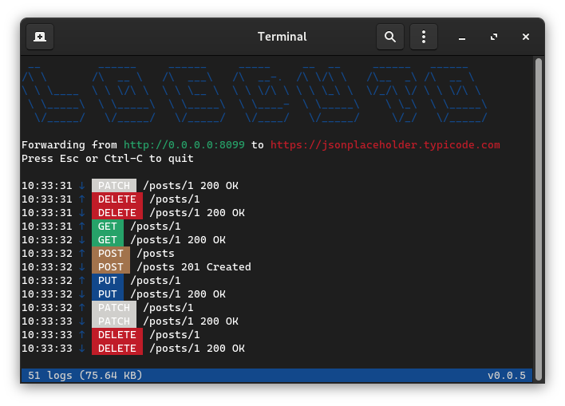

# Logduto


An unpretentious HTTP request logger.



## Install

Download binary executable from [Releases](https://github.com/eduhds/logduto/releases).

```sh
wget https://github.com/eduhds/logduto/releases/download/0.0.3/Logduto-0.0.3-$(uname).tar.gz

tar -xf Logduto*.tar.gz

chmod +x logduto

sudo mv logduto /usr/local/bin
```

## Usage

```sh
logduto https://cat-fact.herokuapp.com
```

```
Usage: Logduto [--help] [--version] [--host VAR] [--port VAR] [--logs VAR] [--timeout VAR] [--data] [--clean] url

Positional arguments:
  url            URL to redirect all requests to [required]

Optional arguments:
  -h, --help     shows help message and exits
  -v, --version  prints version information and exits
  -H, --host     specify host for the server [nargs=0..1] [default: "0.0.0.0"]
  -p, --port     specify port for the server [nargs=0..1] [default: "8099"]
  -l, --logs     specify the directory where to save logs, requests and responses files [nargs=0..1] [default: "./logs"]
  -t, --timeout  specify timeout for the client [nargs=0..1] [default: "10"]
  -d, --data     saves requests and responses to files
  -c, --clean    cleans log files
```

## Developement

```sh
# Build debug
sh scripts/build.sh -d

# Build release
sh scripts/build.sh -r
```

## Credits

- [yhirose/cpp-httplib](https://github.com/yhirose/cpp-httplib)
- [p-ranav/argparse](https://github.com/p-ranav/argparse)
- [termbox/termbox2](https://github.com/termbox/termbox2)
- [typicode/jsonplaceholder](https://github.com/typicode/jsonplaceholder)
